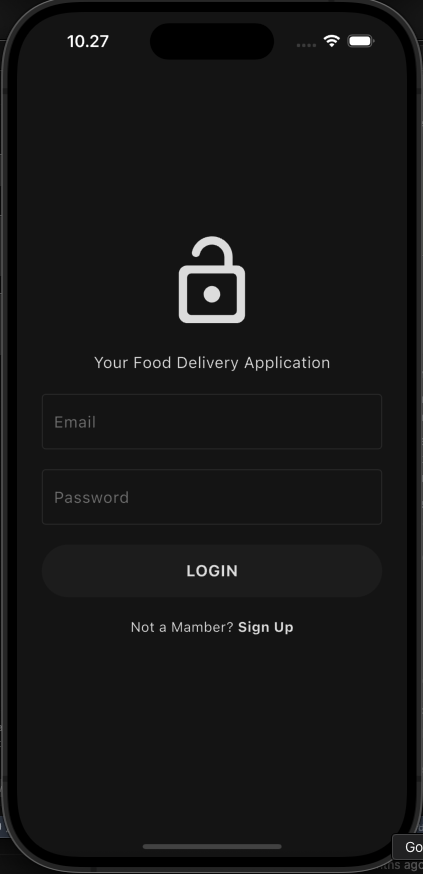
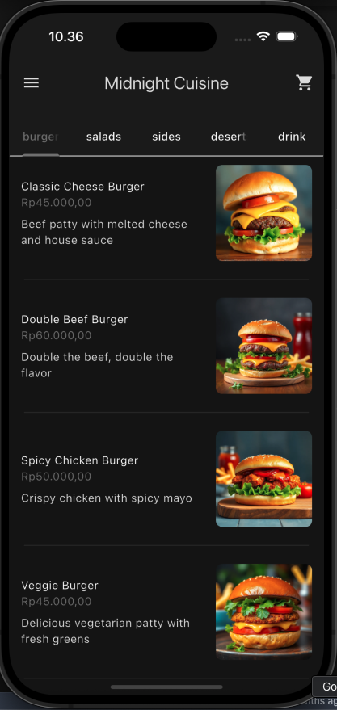
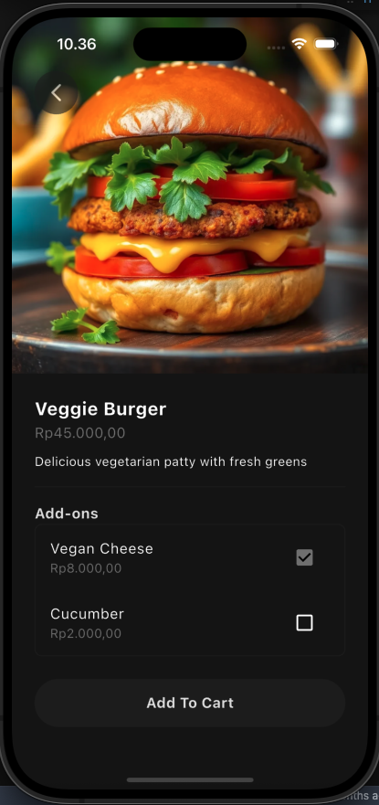
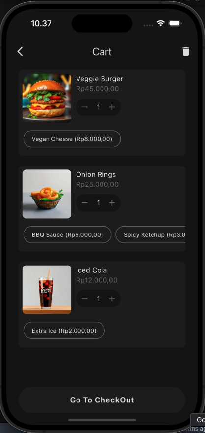
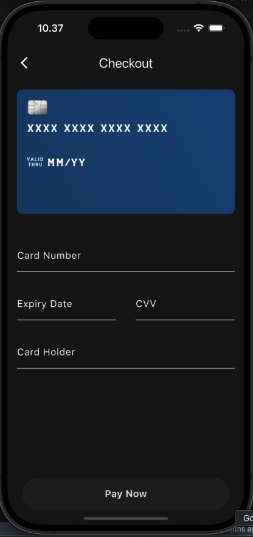
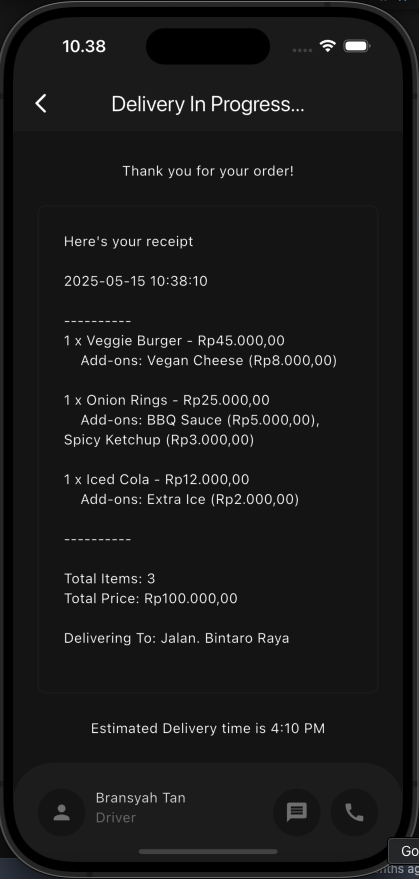

# 🍔 Food Delivery App

This application was created as a restaurant food delivery system using Flutter.
It emphasizes clean UI, modular architecture, and Firebase integration for seamless backend services.

---

## ✨ Features

- 🧾 View full menu with categories
- 🍽️ Menu detail page with images & descriptions
- 🛒 Cart page with quantity management
- 💳 Card payment page (dummy integration)
- 🧾 Receipt page after checkout
- 🔐 Firebase Auth (Login/Register)

---

## 📸 Screenshots

| Login Page                             | Menu Page                            |
| -------------------------------------- | ------------------------------------ |
|  |  |

| Detail Menu                              | Cart Page                            |
| ---------------------------------------- | ------------------------------------ |
|  |  |

| Card Payment                         | Receipt Page                               |
| ------------------------------------ | ------------------------------------------ |
|  |  |

---

## 🚀 Getting Started

### Prerequisites

- Flutter SDK `^3.7.2`
- Firebase project with Firestore & Authentication enabled

### Install Dependencies

```bash
  git clone https://github.com/bransyahtan/food_delivery.git
  cd food_delivery
```

```bash
flutter pub get
```

### Run App:

```bash
flutter run
```

## 🛠️ Tech Stack

- Flutter — UI Framework
- Firebase — Auth & Firestore
- Provider — State Management
- Intl — Currency formatting
- Flutter Credit Card — Payment form UI

## ⚠️ Notes

- 💳 Payment page is dummy, not connected to real payment gateway.
- 📷 Screenshots are located in the assets/readme/ folder.
